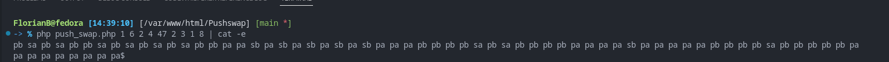

# Pushswap

## Introduction

👋 Bienvenue !

Le but de ce projet était de créer un algorithme en PHP pour trier une série de chiffres entrée et afficher quelle méthode avait été utilisée.

## Fonctionnalités

- Trie la liste dans l'ordre
- Affiche quelle méthode a été utilisée

## Captures d'écran

